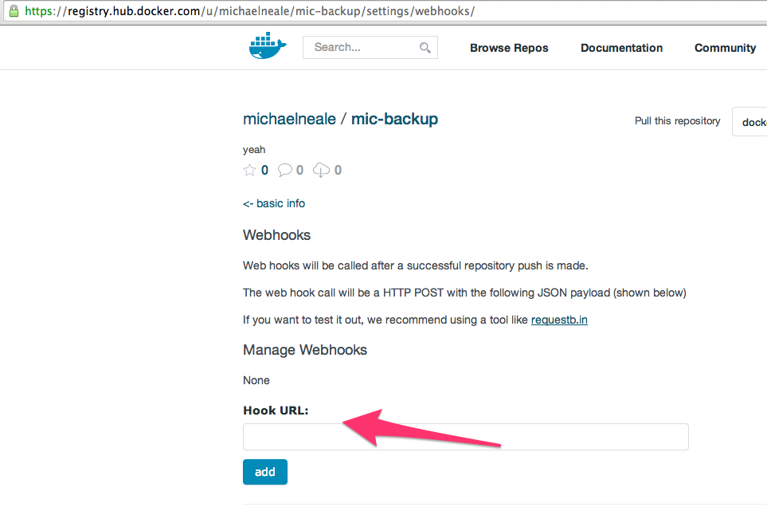

dockerhub-plugin
================

This plugin offer integration with DockerHub, using dockerhub hook to trigger Jenkins job to interact with docker image
and implement continuous delivery pipelines based on Docker.

Receiving new image notification as web-hook from DockerHub, jenkins will trigger all jobs that have DockerHub trigger
enabled and use the incoming Docker image as part of the Build. A `DockerHub Pull` build step is provided to retrieve
the latest image from Hub.

# How to

Configure your DockerHub repository with a webhook to your public jenkins instance `http://JENKINS/dockerhub-webhook/`

In your <a href="https://hub.docker.com">hub.docker.com</a> repository, you can find the "webhooks" section and point it to your jenkins instance: 

# What's next

Set DockerHub repository status based on build result
See also [trello board](https://trello.com/b/unRZLtCH/dockerhub-plugin)
